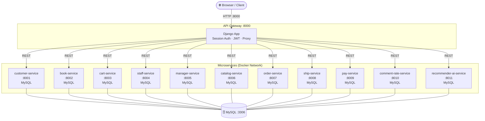
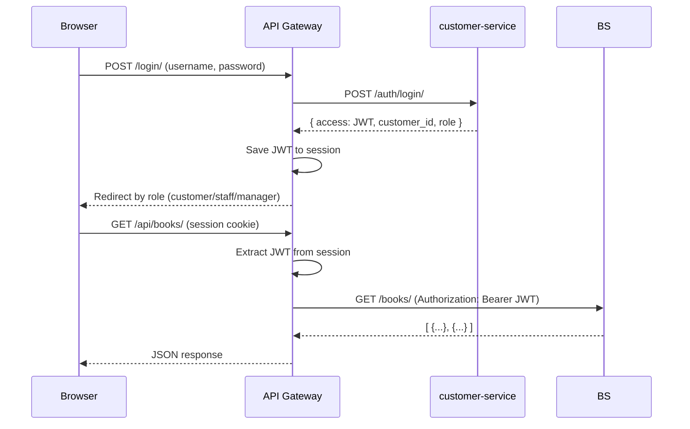

# BookStore Microservice — Architecture Diagram

## 1. High-Level Overview

```
┌─────────────────────────────────────────────────────────────┐
│                        CLIENT (Browser)                     │
└───────────────────────────────┬─────────────────────────────┘
                                │ HTTP :8000
                                ▼
┌─────────────────────────────────────────────────────────────┐
│                     API GATEWAY  (:8000)                    │
│   Django · Session-based Auth · JWT decode · Proxy views    │
│                                                             │
│  Templates: landing, login, register, customer/*, staff/*,  │
│             manager/*, warehouse/*, sales/*                 │
└──┬────┬────┬────┬────┬────┬────┬────┬────┬────┬────────────┘
   │    │    │    │    │    │    │    │    │    │
   ▼    ▼    ▼    ▼    ▼    ▼    ▼    ▼    ▼    ▼
  [1]  [2]  [3]  [4]  [5]  [6]  [7]  [8]  [9]  [10]
```

| #   | Service                | Port  |
| --- | ---------------------- | ----- |
| 1   | customer-service       | :8001 |
| 2   | book-service           | :8002 |
| 3   | cart-service           | :8003 |
| 4   | staff-service          | :8004 |
| 5   | manager-service        | :8005 |
| 6   | catalog-service        | :8006 |
| 7   | order-service          | :8007 |
| 8   | ship-service           | :8008 |
| 9   | pay-service            | :8009 |
| 10  | comment-rate-service   | :8010 |
| 11  | recommender-ai-service | :8011 |

---

## 2. Mermaid Architecture Diagram



---

## 3. Authentication Flow



---

## 4. Service Details

### 4.1 customer-service (:8001)

**Role:** Authentication & customer profile management  
**DB:** `customer_db` (MySQL)

**Models:**

```
Customer
├── name        CharField
├── email       EmailField (unique)
├── phone       CharField
└── address     TextField

UserProfile
├── user        OneToOneField(User)
├── role        CharField [customer | staff | manager]
└── customer    OneToOneField(Customer)
```

**Endpoints:**

```
POST   /auth/register/
POST   /auth/login/          → returns JWT
GET    /customers/
POST   /customers/
GET    /customers/<id>/
PUT    /customers/<id>/
DELETE /customers/<id>/
POST   /customers/<id>/change-password/
```

---

### 4.2 book-service (:8002)

**Role:** Book catalog management  
**DB:** `book_db` (MySQL)

**Models:**

```
Publisher
├── name, address, phone, email, website
├── description, is_active
└── created_at, updated_at

Category
├── name        (choices: fiction, science, tech, ...)
├── display_name, description, icon, color
├── is_active, order
└── created_at, updated_at

Book
├── title, author, isbn
├── image_url   URLField
├── price       DecimalField
├── stock       IntegerField
├── description TextField
├── publisher   FK(Publisher)
├── category    FK(Category)
└── created_at, updated_at
```

**Endpoints:**

```
GET    /books/               → public (no auth)
POST   /books/               → staff/manager only
GET    /books/<id>/          → authenticated
PUT    /books/<id>/          → staff/manager only
DELETE /books/<id>/          → staff/manager only
GET    /publishers/
POST   /publishers/
GET    /publishers/<id>/
GET    /categories/
POST   /categories/
GET    /categories/<id>/
```

---

### 4.3 cart-service (:8003)

**Role:** Shopping cart management  
**DB:** `cart_db` (MySQL)

**Models:**

```
Cart
└── customer_id   IntegerField (unique)

CartItem
├── cart          FK(Cart)
├── book_id       IntegerField
└── quantity      IntegerField
```

**Endpoints:**

```
GET    /carts/
POST   /carts/
GET    /carts/<id>/
PUT    /carts/<id>/
DELETE /carts/<id>/
GET    /carts/customer/<customer_id>/
GET    /cart-items/
POST   /cart-items/
GET    /cart-items/<id>/
PUT    /cart-items/<id>/
DELETE /cart-items/<id>/
```

---

### 4.4 staff-service (:8004)

**Role:** Staff account management  
**DB:** `staff_db` (MySQL)

**Endpoints:**

```
GET    /staffs/
POST   /staffs/
GET    /staffs/profile/
GET    /staffs/<id>/
PUT    /staffs/<id>/
DELETE /staffs/<id>/
```

---

### 4.5 manager-service (:8005)

**Role:** Aggregated dashboard statistics  
**DB:** `manager_db` (MySQL)

**Endpoints:**

```
GET    /manager/dashboard/   → aggregated stats (orders, revenue, ...)
```

---

### 4.6 catalog-service (:8006)

**Role:** Product catalog (catalog entries linked to books)  
**DB:** `catalog_db` (MySQL)

**Endpoints:**

```
GET    /products/
POST   /products/
```

---

### 4.7 order-service (:8007)

**Role:** Order lifecycle management  
**DB:** `order_db` (MySQL)

**Models:**

```
Order
├── customer_id       IntegerField
├── total_amount      DecimalField
├── status            [pending|created|processing|paid|shipping|completed|cancelled]
├── shipping_address  CharField
└── created_at        DateTimeField

OrderItem
├── order      FK(Order)
├── product_id IntegerField
├── quantity   IntegerField
└── unit_price DecimalField
```

**Endpoints:**

```
GET    /orders/
POST   /orders/
GET    /orders/<id>/
PATCH  /orders/<id>/       → update status
DELETE /orders/<id>/
```

---

### 4.8 ship-service (:8008)

**Role:** Shipment tracking  
**DB:** `ship_db` (MySQL)

**Models:**

```
Shipment
├── order_id          IntegerField
├── shipping_address  CharField
├── status            [pending|processing|shipped|delivered|cancelled]
├── tracking_code     CharField
└── created_at        DateTimeField
```

**Endpoints:**

```
GET    /shipments/
POST   /shipments/
GET    /shipments/order/<order_id>/
```

---

### 4.9 pay-service (:8009)

**Role:** Payment processing  
**DB:** `pay_db` (MySQL)

**Models:**

```
Payment
├── order_id        IntegerField
├── amount          DecimalField
├── method          [cod|bank_transfer|credit_card|...]
├── status          [pending|completed|failed|refunded]
├── transaction_id  CharField
└── created_at      DateTimeField
```

**Endpoints:**

```
GET    /payments/
POST   /payments/
GET    /payments/order/<order_id>/
```

---

### 4.10 comment-rate-service (:8010)

**Role:** Product reviews & ratings  
**DB:** `review_db` (MySQL)

**Models:**

```
Review
├── customer_id  IntegerField
├── product_id   IntegerField
├── rating       IntegerField (1–5)
├── comment      TextField
└── created_at   DateTimeField
```

**Endpoints:**

```
GET    /reviews/             → public (no auth)
POST   /reviews/             → authenticated
```

---

### 4.11 recommender-ai-service (:8011)

**Role:** AI-based book recommendations per customer  
**DB:** `recommender_db` (MySQL)

**Endpoints:**

```
GET    /recommendations/<customer_id>/    → recommended books list
```

---

## 5. Role-Based Access Summary

| Role     | Dashboard              | Books | Orders      | Payments | Shipments   | Staff Mgmt |
| -------- | ---------------------- | ----- | ----------- | -------- | ----------- | ---------- |
| Customer | `/customer/dashboard/` | View  | View own    | View own | View own    | ✗          |
| Staff    | `/staff/dashboard/`    | CRUD  | View/Update | View     | View/Update | ✗          |
| Manager  | `/manager/dashboard/`  | CRUD  | Full        | Full     | Full        | Full CRUD  |

---

## 6. JWT Token Structure

```json
{
  "username": "john_doe",
  "role": "customer",
  "customer_id": 42,
  "exp": 1741824000
}
```

- **Secret:** `bookstore-shared-jwt-secret` (env: `JWT_SIGNING_KEY`)
- **Algorithm:** HS256
- **Transport:** `Authorization: Bearer <token>` (service-to-service)
- **Storage:** Django session (browser-side)

---

## 7. Docker Compose Network

```
bookstore-microservice_default (bridge network)
├── api-gateway          → 0.0.0.0:8000
├── customer-service     → 0.0.0.0:8001
├── book-service         → 0.0.0.0:8002
├── cart-service         → 0.0.0.0:8003
├── staff-service        → 0.0.0.0:8004
├── manager-service      → 0.0.0.0:8005
├── catalog-service      → 0.0.0.0:8006
├── order-service        → 0.0.0.0:8007
├── ship-service         → 0.0.0.0:8008
├── pay-service          → 0.0.0.0:8009
├── comment-rate-service → 0.0.0.0:8010
├── recommender-ai-service → 0.0.0.0:8011
└── mysql-db             → 0.0.0.0:3306
```
